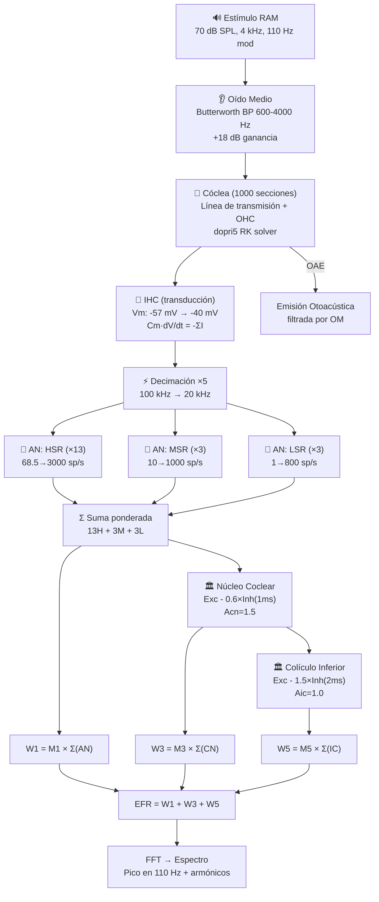

# Análisis Exhaustivo del Modelo de Verhulst (2018) — Perspectiva Fonoaudiológica

## Diagrama General del Modelo


---

## 1. Visión General del Pipeline

El modelo de Verhulst et al. (2018) es una simulación biofísica completa de la **periferia auditiva humana** que reproduce el camino del sonido desde el canal auditivo externo hasta las respuestas neurales del tronco encefálico. El pipeline completo es:

```
Sonido (presión acústica)
  → Oído Medio (filtro pasa-banda 600–4000 Hz)
    → Cóclea / Membrana Basilar (1000 secciones, línea de transmisión)
      → Células Ciliadas Internas (IHC) — transducción mecano-eléctrica
        → Nervio Auditivo (3 tipos de fibras: HSR, MSR, LSR)
          → Núcleo Coclear (CN) — excitación-inhibición
            → Colículo Inferior (IC) — segundo nivel de integración
              → Ondas ABR (W1, W3, W5) → Suma = EFR
```

> [!IMPORTANT]
> Este modelo simula **en dirección forward** (del sonido al EFR). No es un modelo inverso: no puede deducir el audiograma a partir del EFR.

---

## 2. Análisis Detallado de Cada Etapa

### ETAPA 0: Generación del Estímulo (Entrada)

**Archivo fuente:** [get_RAM_stims.py](file:///c:/Users/camix/Desktop/metodologiaDeLaInvestigacion/regelaboForked/backend/src/simulation/Verhulst/src/utils/get_RAM_stims.py)

El modelo acepta cualquier señal acústica como entrada, pero el estímulo estándar es un **tono RAM** (Rectangular Amplitude Modulation):

| Parámetro | Valor por defecto | Significado clínico |
|-----------|-------------------|---------------------|
| Nivel | 70 dB SPL | Intensidad conversacional |
| f_portadora | 4000 Hz | Frecuencia del tono puro |
| f_modulación | 110 Hz | Ritmo de fluctuación del volumen |
| Profundidad | 100% (md=1) | Silencio completo entre pulsos |
| Ciclo de trabajo | 25% | Pulsos breves → mayor sincronización neural |
| Duración | 400 ms | Suficiente para análisis espectral |

**Relevancia fonoaudiológica:** La modulación rectangular (vs. sinusoidal SAM) produce flancos abruptos que activan más neuronas simultáneamente, generando un EFR más robusto y clínicamente medible.

---

### ETAPA 1: Oído Medio

**Archivo fuente:** [cochlear_model2018.py, líneas 344–355](file:///c:/Users/camix/Desktop/metodologiaDeLaInvestigacion/regelaboForked/backend/src/simulation/Verhulst/src/core/cochlear_model2018.py#L344-L355)

Se modela como un **filtro Butterworth pasa-banda** de primer orden (600–4000 Hz) con una ganancia de 18 dB:

| Parámetro | Valor | Correlato anatómico |
|-----------|-------|---------------------|
| Banda pasante | 600–4000 Hz | Resonancia de la cadena osicular |
| Ganancia | 18 dB (+8x) | Relación de áreas tímpano/estribo × palanca osicular |
| Área del tímpano | 60 mm² | Membrana timpánica |
| Área del estribo | 3 mm² | Platina del estribo |
| Transformador | 30:1 | Ratio de impedancias aire→fluido |

**Función biológica:** Transforma la presión acústica del aire (baja impedancia) en presión del fluido coclear (alta impedancia), maximizando la transferencia de energía. Sin el oído medio, se perdería el 99.9% de la energía sonora por reflexión.

---

### ETAPA 2: Mecánica Coclear (Membrana Basilar)

**Archivo fuente:** [cochlear_model2018.py](file:///c:/Users/camix/Desktop/metodologiaDeLaInvestigacion/regelaboForked/backend/src/simulation/Verhulst/src/core/cochlear_model2018.py)

Esta es la etapa más compleja y computacionalmente costosa del modelo. La cóclea se modela como una **línea de transmisión acoplada** de **1000 secciones** (cada una de ~35 µm), donde cada sección representa un segmento de la membrana basilar (BM) con su propia frecuencia de resonancia.

#### 2.1 Mapa Tonotópico (Greenwood)

Cada sección tiene una frecuencia característica (CF) calculada con la función de Greenwood:

```
f(x) = 20682 × 10^(-61.765 × x) - 140.6
```

| Posición | CF | Rigidez BM |
|----------|-----|------------|
| Base (x=0) | ~20 kHz | Máxima (rígida) |
| 1 kHz (sección ~500) | 1000 Hz | Intermedia |
| Ápice (x=35mm) | ~20 Hz | Mínima (flexible) |

#### 2.2 Amplificador Coclear (OHC) — Polos de Shera

Los **polos de Shera** son el mecanismo central para modelar la **ganancia coclear** proporcionada por las células ciliadas externas (OHC):

- `SheraP` (polo actual) → controla el factor de calidad Q de cada sección
- Polo pequeño = más amplificación = mejor selectividad frecuencial = oído sano
- Polo grande = menos amplificación = peor sintonización = **pérdida auditiva**

**Parámetros derivados del polo:**
- `SheraD`: amortiguamiento (negativo = amplificación activa)
- `SheraMu`: retardo de retroalimentación (en ciclos de CF)
- `SheraRho`: ganancia de la onda reflejada de Zweig

#### 2.3 Compresión No-Lineal

Las OHC saturan con sonidos intensos, implementando la **compresión coclear** (~0.2–0.4 dB/dB):

```
Sonido suave → polo bajo → OHC amplifican → BM vibra mucho (ganancia ~60 dB)
Sonido fuerte → polo alto → OHC saturan → BM vibra proporcionalmente menos
```

- `Vknee1`: umbral inferior de compresión (velocidad BM a ~20 dB SPL)
- `Vknee2`: umbral superior (saturación completa)
- `PoleE = 0.31`: polo de saturación (máximo polo, mínima ganancia)

#### 2.4 Irregularidades de Zweig → Emisiones Otoacústicas (OAE)

Perturbaciones aleatorias del 5% en la BM (`IrrPct=0.05`) generan **reflexiones parciales** de la onda viajera. Estas reflexiones viajan de vuelta a la base y se emiten como OAE a través del oído medio. Se implementan mediante un **buffer circular** con interpolación cúbica.

#### 2.5 Solver Numérico

- Integrador: Runge-Kutta adaptativo de 5° orden (dopri5)
- Sistema tridiagonal resuelto con algoritmo de Thomas en **C compilado** (tridiag.dll)
- El estado tiene 2×(N+1) variables: velocidad V y desplazamiento Y de cada sección

**Salidas de esta etapa:**
- `Vsolution`: velocidad de la BM en los probe points (m/s)
- `Ysolution`: desplazamiento de la BM (m)
- `oto_emission`: emisión otoacústica (Pa)

---

### ETAPA 3: Célula Ciliada Interna (IHC)

**Archivo fuente:** [inner_hair_cell2018.py](file:///c:/Users/camix/Desktop/metodologiaDeLaInvestigacion/regelaboForked/backend/src/simulation/Verhulst/src/core/inner_hair_cell2018.py)

Modela la **transducción mecano-eléctrica**: convierte la vibración mecánica de la BM en una señal eléctrica (potencial de membrana Vm).

#### Circuito Eléctrico Equivalente

```
Cm × dVm/dt = -(Imet + Ikf + Iks + Ileak)
```

| Corriente | Conductancia | Potencial | Rol biológico |
|-----------|-------------|-----------|---------------|
| **Imet** (MET) | 30 nS | EP = +90 mV | Despolarización por deflexión de estereocilios |
| **Ikf** (K⁺ rápido) | 230 nS | -71 mV | Repolarización rápida (τ = 0.3 ms) |
| **Iks** (K⁺ lento) | 230 nS | -78 mV | Adaptación lenta (τ = 8 ms) |
| Ileak (fuga) | 0 nS | — | Desactivada en este modelo |

**Parámetros clave:**

| Parámetro | Valor | Significado |
|-----------|-------|-------------|
| Cm | 12.5 pF | Capacitancia de membrana |
| Vm_reposo | -57 mV | Potencial en silencio |
| Vm_pico | -40 mV | Potencial a 100 dB SPL (saturación) |
| EP | +90 mV | Potencial endococlear ("batería biológica") |
| x0 | 20 nm | Deflexión basal de estereocilios en reposo |
| tauMet | 50 µs | Velocidad del canal MET (extremadamente rápido) |
| magic_constant | 0.118 | Factor velocidad BM → deflexión de estereocilios |

**Canal MET:** Función doble Boltzmann asimétrica:
```
mt = 1 / (1 + exp((x0-µ)/s0) × (1 + exp((x0-µ)/s1)))
```
- Deflexiones positivas (hacia el kinocilio) → abren canales → despolarización
- Deflexiones negativas → cierran canales → hiperpolarización (pero menos simétrica)

**Fase de estabilización:** 50 ms sin estímulo para que la IHC alcance estado estacionario antes de la simulación.

---

### ETAPA 4: Nervio Auditivo (AN)

**Archivo fuente:** [auditory_nerve2018.py](file:///c:/Users/camix/Desktop/metodologiaDeLaInvestigacion/regelaboForked/backend/src/simulation/Verhulst/src/core/auditory_nerve2018.py)

Convierte el Vm de la IHC en **tasas de disparo neural** (spikes/s) mediante un modelo biofísico de vesículas sinápticas.

#### Tres Tipos de Fibras

| Tipo | Tasa espontánea | Tasa pico | Nº por IHC | Umbral | Rol clínico |
|------|-----------------|-----------|------------|--------|-------------|
| **HSR** | 68.5 sp/s | 3000 sp/s | 13 (~60%) | Bajo | Detección de sonidos suaves |
| **MSR** | 10 sp/s | 1000 sp/s | 3 (~16%) | Medio | Rango dinámico intermedio |
| **LSR** | 1 sp/s | 800 sp/s | 3 (~16%) | Alto | **Codificación en ruido** |

> [!WARNING]
> La pérdida selectiva de fibras LSR/MSR sin afectar OHC ni audiograma es la base de la **Sordera Oculta** (Cochlear Synaptopathy). El modelo permite simularla modificando `nH`, `nM`, `nL`.

#### Modelo de Vesículas Sinápticas (2 Pools)

```
Pool de Reserva (wt, max=60) --[x=700/s]--> RRP (qt, max=14) --[exocitosis]--> disparo
                              <--[r=220/s]--
```

| Parámetro | Valor | Significado |
|-----------|-------|-------------|
| M | 14 vesículas | Capacidad del RRP (Ready Releasable Pool) |
| M2 | 60 vesículas | Capacidad del pool de reserva |
| x | 700/s | Tasa de reposición RRP ← reserva |
| r1 | 220/s | Tasa de reposición del pool de reserva |
| ss | 1.5 mV | Sensibilidad Vm → tasa de exocitosis |
| tCa | 0.2 ms | Constante de tiempo del canal Ca²⁺ |

#### Refractariedad Neural

| Tipo | Duración | Efecto |
|------|----------|--------|
| Absoluta | 0.6 ms | La fibra NO puede disparar bajo ninguna circunstancia |
| Relativa | 0.6 ms (τ) | Probabilidad reducida de disparo (decae exponencialmente) |

**Función de transferencia Vm → exocitosis:**
```
activación = √(1 / (1 + exp(-(Vm - vh) / ss)))
tasa_vesicular = pp × (activación filtrada)²
```
La raíz cuadrada + filtrado + cuadrado modela la **cooperatividad de segundo orden del Ca²⁺** en la maquinaria de fusión vesicular.

**Submuestreo:** La señal se decima por factor 5 antes de entrar al AN (la sinapsis actúa como filtro paso bajo natural).

---

### ETAPA 5: Núcleo Coclear (CN)

**Archivo fuente:** [ic_cn2018.py, líneas 34–109](file:///c:/Users/camix/Desktop/metodologiaDeLaInvestigacion/regelaboForked/backend/src/simulation/Verhulst/src/core/ic_cn2018.py#L34-L109)

Primera estación de relevo del tronco encefálico. Implementa un modelo de **excitación-inhibición con retardo**:

```
CN = Acn × [Excitación(AN) - Scn × Inhibición(AN_retardado)]
```

| Parámetro | Valor | Significado |
|-----------|-------|-------------|
| Acn | 1.5 | Ganancia excitatoria |
| Scn | 0.6 | Peso inhibitorio |
| Retardo inhibitorio | 1 ms | Vía polisináptica inhibitoria |
| τ_excitatorio | 0.5 ms | Sinapsis glutamatérgica directa |
| τ_inhibitorio | 2 ms | Sinapsis glicinérgica/GABAérgica |

**Suma ponderada de fibras AN:**
```
summedAN = 13×HSR + 3×MSR + 3×LSR  (por sección coclear)
```

---

### ETAPA 6: Colículo Inferior (IC)

**Archivo fuente:** [ic_cn2018.py, líneas 111–165](file:///c:/Users/camix/Desktop/metodologiaDeLaInvestigacion/regelaboForked/backend/src/simulation/Verhulst/src/core/ic_cn2018.py#L111-L165)

Segundo nivel de integración neural. Mismo esquema que CN pero con **inhibición más fuerte**:

```
IC = Aic × [Excitación(CN) - Sic × Inhibición(CN_retardado)]
```

| Parámetro | Valor | Diferencia vs CN |
|-----------|-------|------------------|
| Aic | 1.0 | Menor ganancia (integración conservadora) |
| Sic | **1.5** | Inhibición 2.5× más fuerte que CN |
| Retardo | **2 ms** | Doble que CN (circuito más largo) |

---

### ETAPA 7: Ondas del ABR y EFR (Salida Final)

**Archivo fuente:** [model2018.py, líneas 303–311](file:///c:/Users/camix/Desktop/metodologiaDeLaInvestigacion/regelaboForked/backend/src/simulation/Verhulst/src/model2018.py#L303-L311)

Las ondas del ABR se obtienen sumando la actividad de todas las secciones cocleares, escaladas por factores empíricos:

| Onda | Generador | Factor de escala | Fórmula |
|------|-----------|-----------------|---------|
| **W1** (Onda I) | Nervio Auditivo | M1 = 4.28×10⁻¹⁴ | `W1 = M1 × Σ(AN_sumado)` |
| **W3** (Onda III) | Núcleo Coclear | M3 = 5.14×10⁻¹⁴ | `W3 = M3 × Σ(CN)` |
| **W5** (Onda V) | Colículo Inferior | M5 = 13.31×10⁻¹⁴ | `W5 = M5 × Σ(IC)` |

**EFR = W1 + W3 + W5** (suma de las tres ondas del ABR)

Los factores M1, M3, M5 fueron calibrados empíricamente para reproducir las amplitudes típicas de los potenciales evocados auditivos humanos (~0.1–0.5 µV).

---

## 3. Perfiles de Pérdida Auditiva (Poles)

Los perfiles de pérdida auditiva se codifican como archivos `StartingPoles.dat` que modifican los polos de Shera:

| Perfil | Descripción | Ejemplo clínico |
|--------|-------------|-----------------|
| `Flat00` | Audición normal (0 dB HL) | Sujeto sano |
| `FlatXX` | Pérdida plana de XX dB HL | Ototoxicidad, presbiacusia temprana |
| `SlopeXX` | Pérdida en pendiente desde 1 kHz | Trauma acústico, presbiacusia |
| `SlopeXX_Y` | Pendiente + pérdida base de Y dB | Pérdida mixta |
| Personalizado | Via `OHC_ind.py` con audiograma real | Cualquier paciente |

Hay **33 perfiles precomputados** disponibles en la carpeta `Poles/`.

---

## 4. Resumen de Entradas y Salidas del Modelo

### Entradas

| Entrada | Tipo | Ejemplo |
|---------|------|---------|
| Señal acústica | Array NumPy | Tono RAM a 4 kHz, 70 dB SPL |
| fs (muestreo) | Float | 100,000 Hz |
| Perfil auditivo (sheraPo) | Array o escalar | `StartingPoles.dat` de Flat00 |
| Nº fibras HSR/MSR/LSR | Int o array | 13, 3, 3 (normal) |
| Irregularidades | 0 o 1 | 1 = con OAE |
| storeflag | String | `'vihlmeb'` = qué guardar |

### Salidas

| Salida | Variable | Unidad | Etapa |
|--------|----------|--------|-------|
| Velocidad BM | `v` | m/s | Cóclea |
| Desplazamiento BM | `y` | m | Cóclea |
| Emisión otoacústica | `emission` | Pa | Cóclea/OM |
| Potencial IHC | `ihc` | V | IHC |
| Tasa HSR | `anfH` | spikes/s | AN |
| Tasa MSR | `anfM` | spikes/s | AN |
| Tasa LSR | `anfL` | spikes/s | AN |
| AN sumado | `an_summed` | spikes/s | AN |
| Resp. CN | `cn` | spikes/s | CN |
| Resp. IC | `ic` | spikes/s | IC |
| Onda I ABR | `w1` | µV | ABR |
| Onda III ABR | `w3` | µV | ABR |
| Onda V ABR | `w5` | µV | ABR |

---

## 5. Flujo de Datos Numérico Completo



---

## 6. Cómo el Modelo Permite Simular Patologías

| Patología | Parámetro que se modifica | Efecto esperado |
|-----------|---------------------------|-----------------|
| **Pérdida conductiva** | Ganancia del oído medio | Reducción uniforme de amplitud |
| **Pérdida coclear (OHC)** | `sheraPo` (polos de Shera) | Pérdida de compresión, ensanchamiento de sintonización |
| **Sordera oculta (sinaptopatía)** | `nH`, `nM`, `nL` | EFR reducido con audiograma normal |
| **Pérdida selectiva LSR** | `nL = 0` | Peor codificación en ruido |
| **Ausencia de amplificación** | `non_linear_type='none'` | Modelo lineal, sin amplificación OHC |

---

## 7. Estoy Listo Para Tus Preguntas

He analizado exhaustivamente los **6 archivos fuente** del modelo:

1. [model2018.py](file:///c:/Users/camix/Desktop/metodologiaDeLaInvestigacion/regelaboForked/backend/src/simulation/Verhulst/src/model2018.py) — Orquestador del pipeline
2. [cochlear_model2018.py](file:///c:/Users/camix/Desktop/metodologiaDeLaInvestigacion/regelaboForked/backend/src/simulation/Verhulst/src/core/cochlear_model2018.py) — Mecánica coclear (763 líneas)
3. [inner_hair_cell2018.py](file:///c:/Users/camix/Desktop/metodologiaDeLaInvestigacion/regelaboForked/backend/src/simulation/Verhulst/src/core/inner_hair_cell2018.py) — Transducción IHC
4. [auditory_nerve2018.py](file:///c:/Users/camix/Desktop/metodologiaDeLaInvestigacion/regelaboForked/backend/src/simulation/Verhulst/src/core/auditory_nerve2018.py) — Fibras del nervio auditivo
5. [ic_cn2018.py](file:///c:/Users/camix/Desktop/metodologiaDeLaInvestigacion/regelaboForked/backend/src/simulation/Verhulst/src/core/ic_cn2018.py) — Núcleos del tronco encefálico
6. [get_RAM_stims.py](file:///c:/Users/camix/Desktop/metodologiaDeLaInvestigacion/regelaboForked/backend/src/simulation/Verhulst/src/utils/get_RAM_stims.py) — Generación de estímulos

**Envíame tus preguntas específicas** sobre cualquier componente, parámetro, etapa o proceso del modelo.
